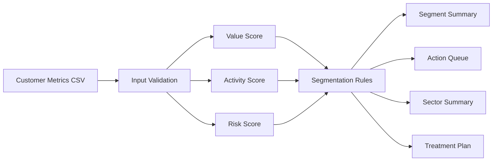

# Customer Segmentation and Risk Evaluation

End-to-end customer analytics project that scores customer value, activity, and risk, then turns those signals into explainable segments and an action queue.

## Business Goal

Commercial and risk teams need a shared customer view: who should be protected, who needs monitoring, and who is still early in the relationship. This project creates transparent scoring rules that connect customer economics with practical next actions.

## Architecture



## Repository Structure

```text
.
├── data/
│   └── customers.csv
├── output/
│   ├── action_queue.csv
│   ├── customer_segments.csv
│   ├── sector_summary.csv
│   ├── segment_summary.csv
│   └── treatment_plan.csv
└── src/
    └── segment_customers.py
```

## What The Pipeline Does

- Validates required customer fields before scoring.
- Scores value from annual revenue, activity from tenure, and risk from late payments plus balance exposure.
- Assigns customers to explainable segments: high value / low risk, watchlist, new relationship, or core customer.
- Adds next-best-action recommendations for relationship and risk teams.
- Summarizes segment-level revenue, balance exposure, and average risk.
- Estimates churn-risk tier from payment behavior, balance exposure, and tenure.
- Builds sector-level risk summaries and treatment playbooks.

## Outputs

| File | Purpose |
| --- | --- |
| `output/customer_segments.csv` | Customer-level scoring, segment, exposure ratio, and next action. |
| `output/segment_summary.csv` | Segment-level rollup of revenue, balance, and risk. |
| `output/action_queue.csv` | Prioritized customer actions for commercial/risk follow-up. |
| `output/sector_summary.csv` | Sector-level revenue, balance, risk, and churn-risk summary. |
| `output/treatment_plan.csv` | Customer-level playbook assignment by risk tier. |

## Run Locally

```bash
python3 src/segment_customers.py
```

No third-party packages are required; the project uses the Python standard library.

## Skills Demonstrated

Customer analytics, risk scoring, churn-risk triage, segmentation design, explainable business rules, stakeholder-friendly action queues, and BI-ready data preparation.
